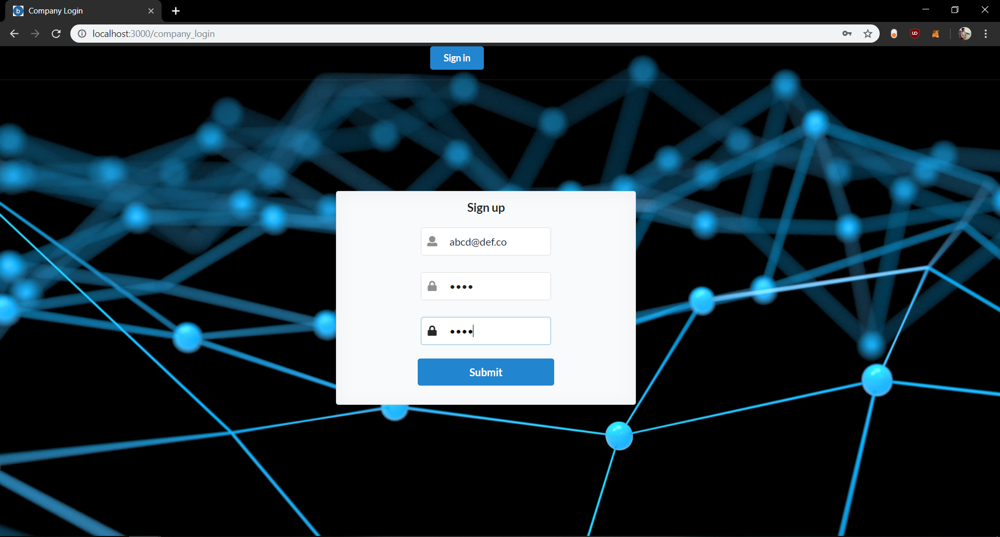
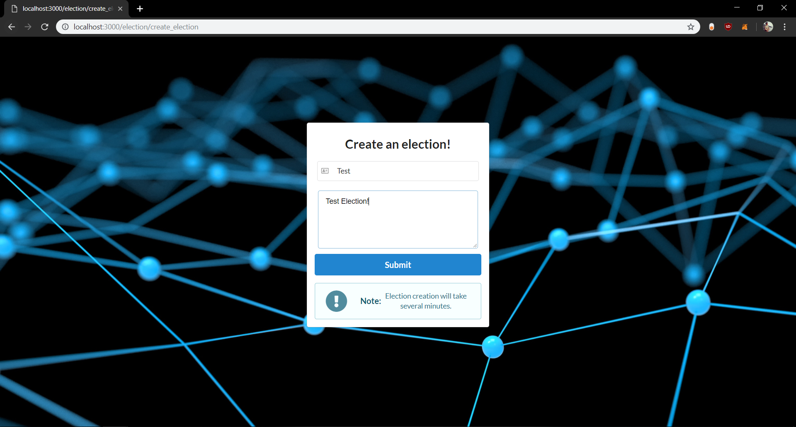
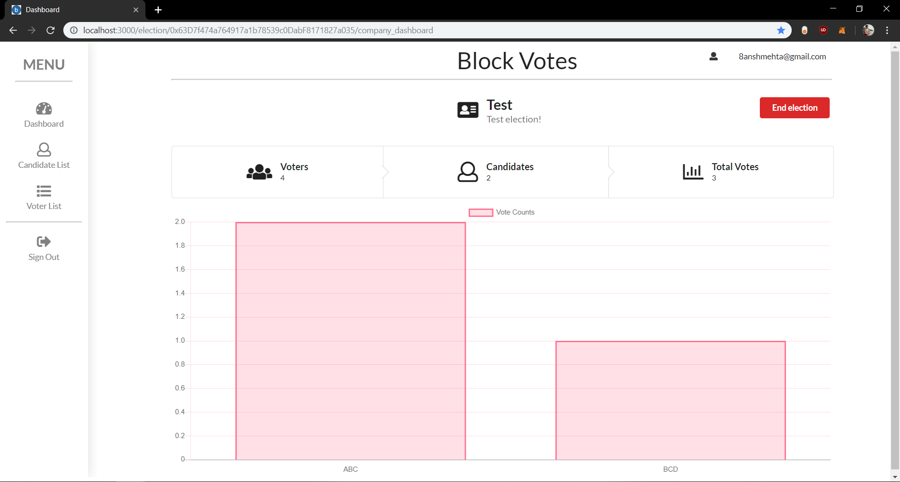
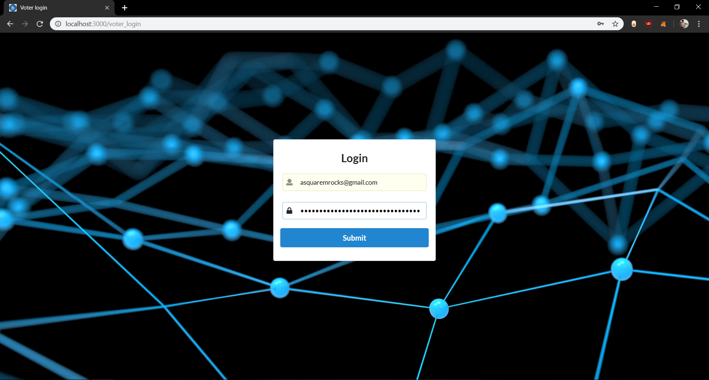
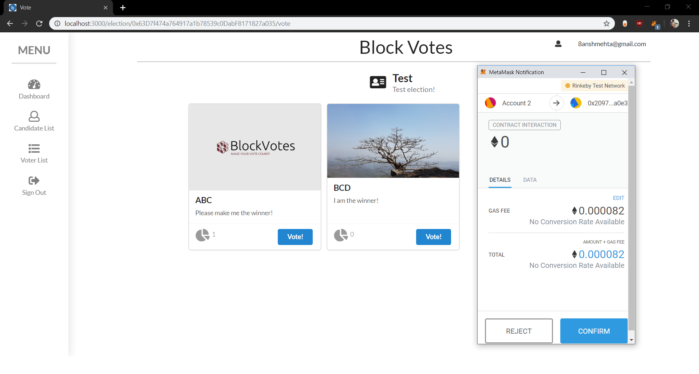
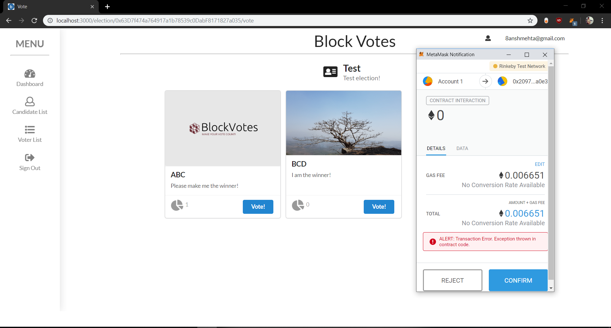
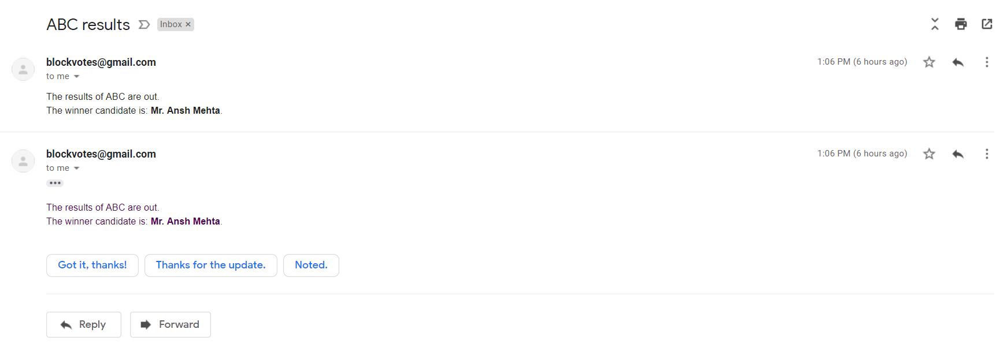

# BlockChainVoting

A blockchain-based E-voting system, created as the final year project of Shri Bhagubhai Mafatlal Polytechnic. Teammates include me, Sayyam Gada and Charmee Mehta.

## Build Setup

```bash
# install dependencies
npm install

# serve with hot reload at localhost:3000
npm start

```

## Technologies used:

-   Solidity
-   Web3
-   Node Mailer
-   AJAX
-   Next.js
-   Semantic UI React
-   IPFS
-   MongoDB
-   ExpressJS
-   Node.js (v11.14.0)

## Screenshots of the app:

Homepage of the application:


Company registers/logs in:


Company creates an election if not created:


Dashboard on successful election creation:


List of candidates for the election (here, you can add candidates):


Candidate has been notified on the mail:


List of voters for the election (here, you can add voters):


Voters have been sent their secure usernames and passwords on the mail:


Voter login page:


Successful voting scenario:


Unsuccessful voting scenario:


Notification to each candidate and voter for the winner of candidates:

